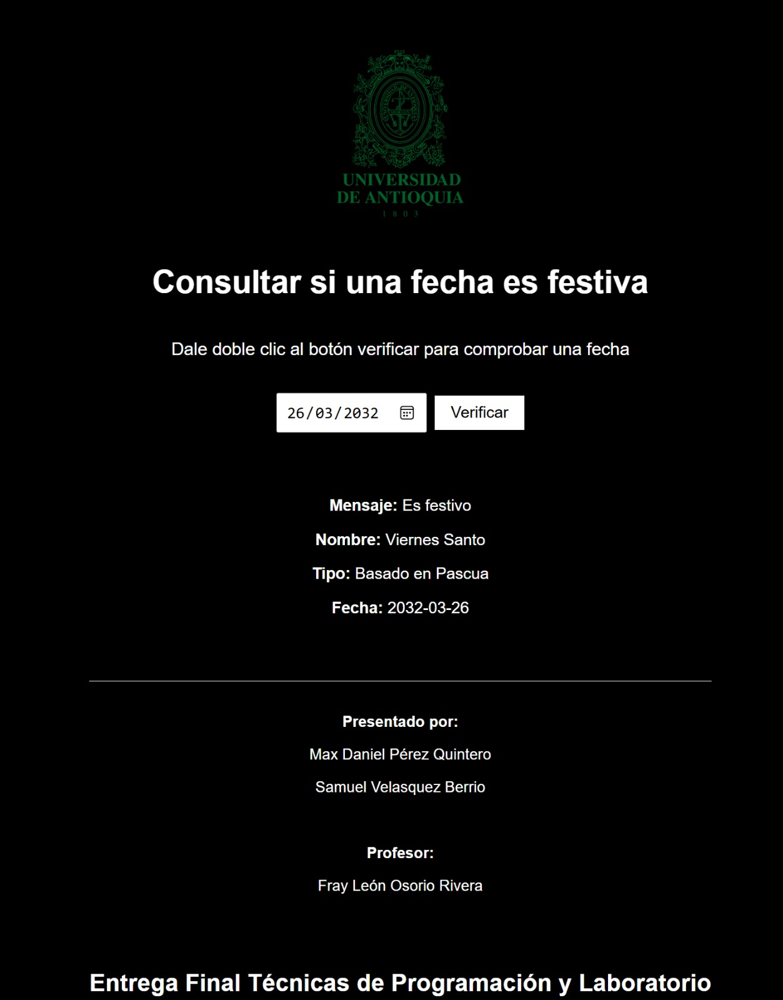

# Entrega Final Técnicas de Programación y Laboratorio

Este proyecto consiste en una aplicación web que permite consultar si una fecha es festiva en Colombia. Desarrollado con **Angular** en el frontend y **Spring Boot** en el backend, realiza consultas a una base de datos PostgreSQL que contiene los días festivos del país.

---

## Funcionalidades

- Selección de una fecha mediante calendario interactivo.
- Consulta en tiempo real al backend.
- Interfaz personalizada y moderna.
- Conexión a base de datos para verificación de días festivos.

---

## Presentado por:

- Max Daniel Pérez Quintero  
- Samuel Velasquez Berrio  

**Profesor:** Fray León Osorio Rivera

---

## Cómo ejecutar

1. Clonar este repositorio.
2. Ejecutar el backend con Spring Boot (`localhost:8080`).
3. Iniciar el frontend con Angular (`ng serve`).
4. Acceder a `http://localhost:4200`.

---

## Captura de pantalla

